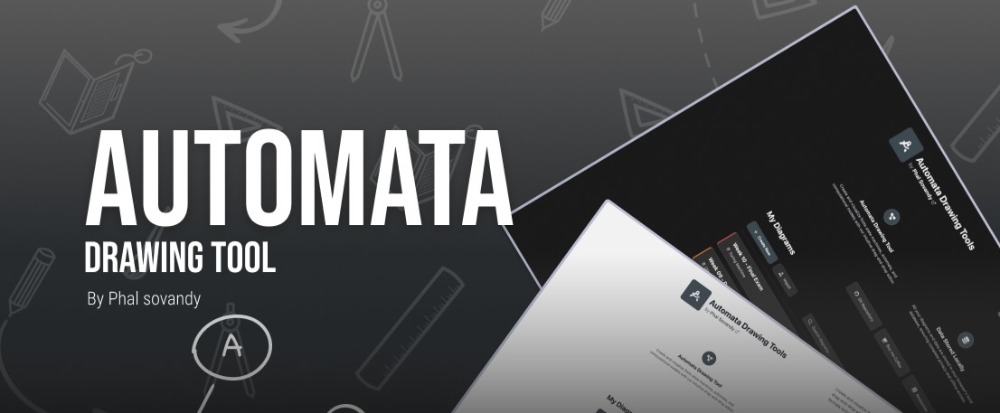

# Automata Drawing Tools

[](https://opensource.org/licenses/MIT)
[](https://github.com/Phal-Sovandy/Automata-Drawing-Tools)
[](https://reactjs.org/)
[](https://vitejs.dev/)
[](https://nodejs.org/)
[](https://developer.mozilla.org/en-US/docs/Web/JavaScript)

<div align="center">
  
  
  
  
  <p><em>A modern React application for designing and visualizing finite state machines, pushdown automata, and Turing machines by Phal Sovandy.</em></p>
</div>

## Features

- **Interactive Canvas**: Draw and edit automata with an intuitive drag-and-drop interface
- **Multiple Automata Types**: Support for DFA, NFA, PDA, and Turing machines
- **Export Options**: Export diagrams as PNG, SVG, LaTeX, or JSON
- **Import/Export**: Full backup and restore functionality
- **Dark/Light Theme**: Modern UI with theme switching
- **Keyboard Shortcuts**: Efficient workflow with comprehensive shortcuts
- **Local Storage**: All data stored locally using IndexedDB

## Project Structure

```
Automata-Drawing-Tools/
├── public/                    # Public assets (copied to build)
│   ├── assets/
│   │   └── images/           # Static images (HTML references)
│   │       └── repo_cover.jpeg      # Repository cover image
│   ├── favicon_icon.png      # Site favicon (HTML reference)
│   ├── favicon.ico           # Site favicon (fallback)
│   ├── manifest.json         # PWA manifest
│   ├── robots.txt           # SEO robots file
│   └── sitemap.xml          # SEO sitemap
├── src/
│   ├── assets/
│   │   └── images/           # Images and icons (imported as ES modules)
│   │       ├── canvas-walkthrough/  # Canvas guide images (canvas_guide_*.png)
│   │       ├── homepage-walkthrough/ # Homepage guide images (home_guide_*.png)
│   │       └── bmc_logo.svg         # BuyMeACoffee logo
│   ├── components/           # React components
│   │   ├── layout/          # Layout components
│   │   │   ├── HomePage.jsx
│   │   │   ├── Sidebar.jsx
│   │   │   └── TopNavigation.jsx
│   │   ├── modals/          # Modal components
│   │   │   ├── AboutModal.jsx
│   │   │   ├── CanvasWalkthroughModal.jsx
│   │   │   ├── ConfirmationModal.jsx
│   │   │   ├── EditDiagramModal.jsx
│   │   │   ├── ExportModal.jsx
│   │   │   ├── HomePageWalkthroughModal.jsx
│   │   │   ├── ImportJSONModal.jsx
│   │   │   ├── ImportOptionsModal.jsx
│   │   │   ├── NewDiagramModal.jsx
│   │   │   ├── SettingsModal.jsx
│   │   │   └── ShortcutsModal.jsx
│   │   ├── ui/              # UI components
│   │   │   ├── ColorPicker.jsx
│   │   │   ├── Dropdown.jsx
│   │   │   ├── LoadingSpinner.jsx
│   │   │   ├── OperationAlerts.jsx
│   │   │   └── SavingStatus.jsx
│   │   ├── Canvas.jsx       # Main canvas component
│   │   └── DotGrid.jsx      # Grid component
│   ├── context/             # React context
│   │   └── FSMContext.jsx   # Main state management
│   ├── styles/              # CSS styles
│   │   ├── base/           # Base styles
│   │   ├── components/     # Component-specific styles
│   │   ├── themes/         # Theme definitions
│   │   ├── utilities/      # Utility classes
│   │   └── index.css       # Main stylesheet
│   ├── utils/              # Utility functions
│   │   ├── ExportUtils.jsx # Export functionality
│   │   ├── FSMClasses.jsx  # Automata classes
│   │   ├── IndexedDBUtils.js # Database utilities
│   │   └── shortcuts.js    # Keyboard shortcuts
│   ├── App.jsx             # Main app component
│   └── index.jsx           # Entry point
├── .editorconfig           # Editor configuration
├── .gitignore             # Git ignore rules
├── index.html             # HTML template
├── package.json           # Dependencies and scripts
└── vite.config.js         # Vite configuration
```

## Installation

1. **Clone the repository**

   ```bash
   git clone https://github.com/Phal-Sovandy/Automata-Drawing-Tool.git
   cd Automata-Drawing-Tool
   ```

2. **Install dependencies**

   ```bash
   npm install
   ```

3. **Start development server**

   ```bash
   npm run dev
   ```

4. **Build for production**
   ```bash
   npm run build
   ```

## Usage

### Creating Diagrams

1. Click "Create New Diagram" on the homepage
2. Choose your automata type (DFA, NFA, PDA, Turing Machine)
3. Add states by double clicking on the canvas
4. Connect states with transitions
5. Set start and accept states

### Export Options

- **PNG**: High-resolution image export
- **SVG**: Vector graphics for web use
- **LaTeX**: For academic papers and documents
- **JSON**: For backup and sharing

## Customization

### Personal Information

Update the following files with your information:

- `package.json`: Author and description
- `src/components/layout/HomePage.jsx`: Name and links
- `src/components/modals/AboutModal.jsx`: Social media links
- `src/context/FSMContext.jsx`: Export metadata

### Styling

- Modify `src/styles/themes/colors.css` for color schemes
- Update `src/styles/components/` for component-specific styles
- Add new themes in `src/styles/themes/`

## Contributing

1. Fork the repository
2. Create a feature branch (`git checkout -b feature/amazing-feature`)
3. Commit your changes (`git commit -m 'Add some amazing feature'`)
4. Push to the branch (`git push origin feature/amazing-feature`)
5. Open a Pull Request

## License

This project is licensed under the MIT License - see the [LICENSE](LICENSE) file for details.

**MIT License Summary:**

- **Commercial Use**: You can use this software in commercial projects
- **Modification**: You can modify the software
- **Distribution**: You can distribute the software
- **Private Use**: You can use the software privately
- **Attribution Required**: You must include the original copyright notice
- **No Warranty**: The software is provided "as is" without warranty

**What this means:**

- You can use Automata Drawing Tools in your own projects
- You can modify and customize it for your needs
- You can distribute it to others
- You must keep the copyright notice and license text
- You cannot hold the author liable for any issues

## Author

**Phal Sovandy**

- GitHub: [@Phal-Sovandy](https://github.com/Phal-Sovandy)
- LinkedIn: [sovandy-phal-382069331](https://www.linkedin.com/in/sovandy-phal-382069331/)

## Acknowledgments

- React team for the amazing framework
- Vite for the fast build tool
- Font Awesome for the icons
- Cursor AI for development assistance and code generation
- All contributors and users

---

Made with dedication by Phal Sovandy
